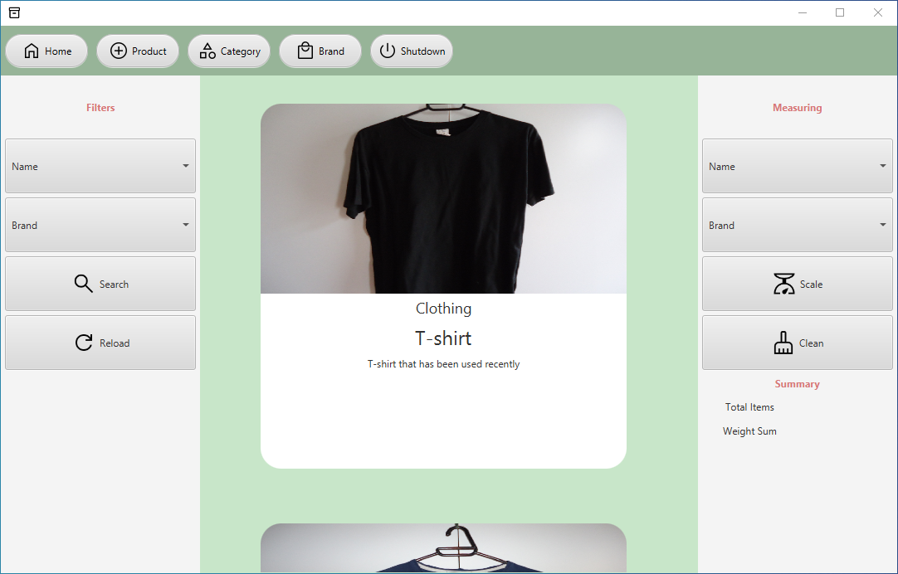
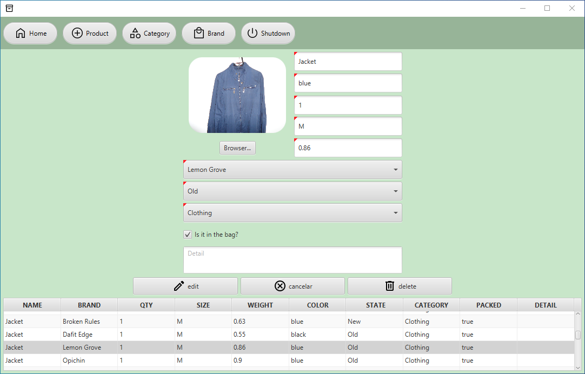
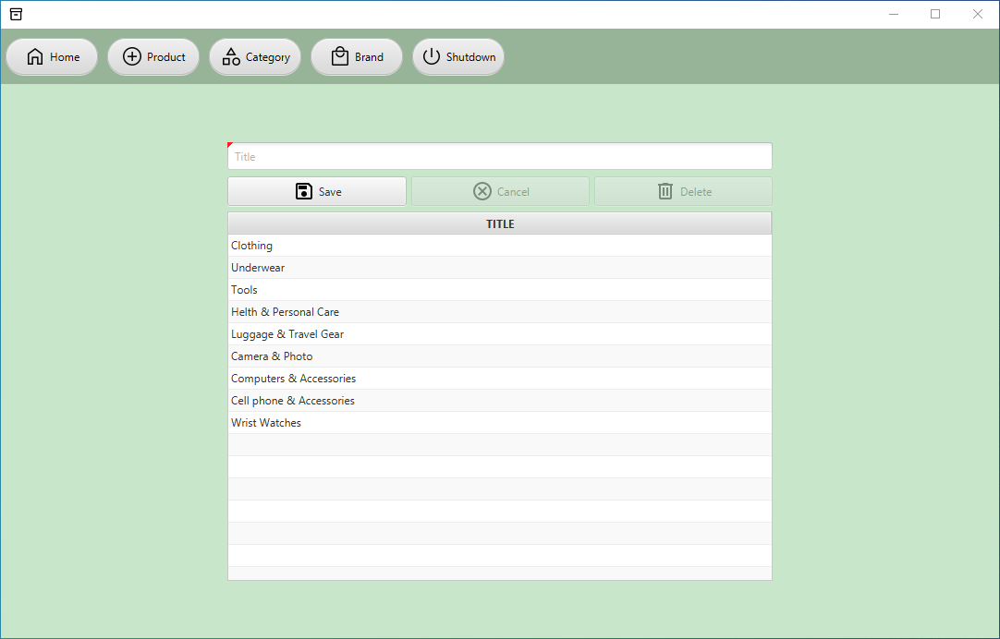
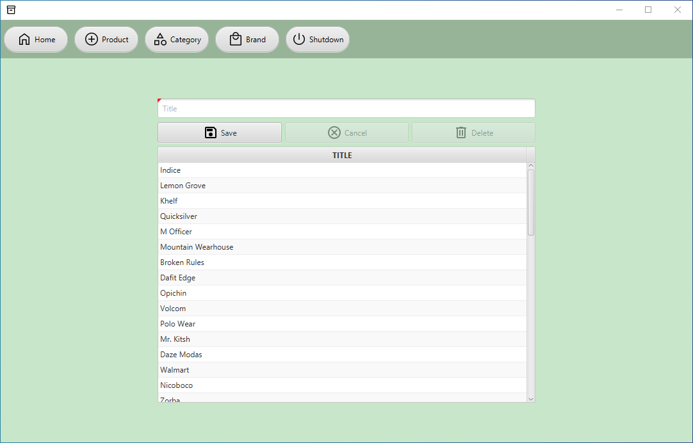

# JavaFX Box

Have you ever wondered what is in your wardrobe and forgot that you had thrown your favorite garment away, then this app 
is for you to keep track of any belongs you might have.  

<h3>Features</h3>

<ul>
  <li>Crud for storing personal products</li>
  <li>Filtering</li>
  <li>Measuring items</li>
  <li>Keep track of what items are on the baggage when you travel abroad</li>
  <li>Friendly design</li>  
</ul>

<h3>Technologies and frameworks</h3>

<ul>
  <li>JavaFX</li>
  <li>FxWeaver</li>
  <li>SpringBoot</li>
  <li>H2 database</li>
  <li>Controlsfx</li>  
</ul>

# Home Screen

  

    Once you open the app you will see the home screen where you will be able to go through your items, you can also filter and 
    measure the weight of a piece of clothing.
  

  

  

# Product Screen

  The product screen is a place where you will be able to add, update and delete items as well as checking the ones you have put in your luggage. 

# Category Screen

   The category screen is a place where you will be able to add, update and delete categories in order to organize your belongs by group.  

# Brand Screen

 

    The brand screen is a place where you will be able to add, update and detele all brands you have.
 

 

